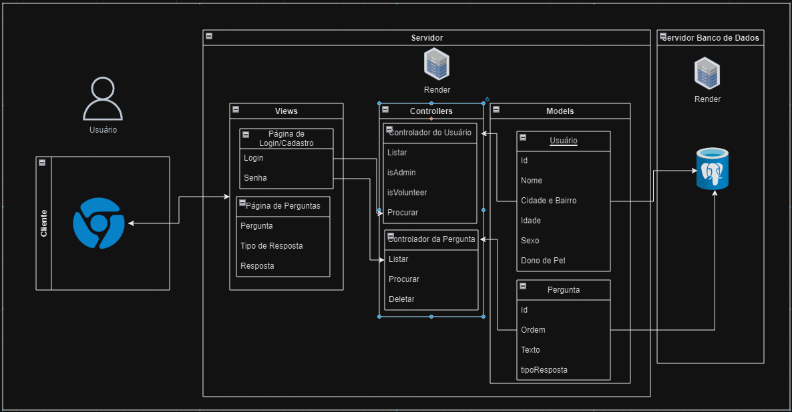

# Arquitetura MVC 
## Explicação
&nbsp;&nbsp;&nbsp;&nbsp; A arquitetura MVC adotada para o projeto utiliza três componentes principais: Model, View e Controller. No Model, são definidas as estruturas de dados (ou futuramente tabelas) para representações do Usuário e de cada Pergunta, conectando-se diretamente ao banco de dados PostgreSQL para que possam ser acessadas as informações. Já na View, é representada a interface do usuário, que inclui a página de cadastro do usuário e cada página de perguntas, utilizando dados fornecidos pelos modelos. Por fim, na camada  atuam como intermediários, recebendo solicitações do usuário, processando-as e retornando respostas apropriadas, garantindo a integração entre modelos e visualizações. A escolha do framework Sails.js proporciona uma estrutura MVC robusta que facilita o desenvolvimento ágil e escalável do sistema. O uso do PostgreSQL como banco de dados possibilita recursos avançados de gerenciamento de dados, garantindo armazenamento seguro das informações do sistema. A divisão clara de responsabilidades entre os componentes simplifica a manutenção e melhora a escalabilidade e testabilidade do sistema. Ao atender aos requisitos de cadastro de usuários, autenticação, resposta a perguntas e escalabilidade, a arquitetura MVC adotada se mostra adequada para o desenvolvimento de um sistema web robusto e eficiente para a coleta de informações sobre donos de pets em todo o mundo.

## Diagrama
